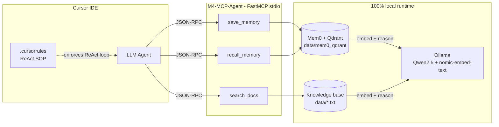

# M4-MCP-Agent

> A **local-first, context-aware MCP server** that gives Cursor (or any MCP client) persistent long-term memory and private document retrieval — powered entirely by **Ollama** on your Mac. No OpenAI key. No cloud round-trip. Your data never leaves the machine.

<p align="left">
  
  
  
  
  
</p>

<!-- TODO: replace with a real demo gif once you have one -->
<!--  -->

---

## Why this exists

Out of the box, an LLM coding assistant inside Cursor has **two embarrassing amnesia problems**:

1. **Zero long-term memory.** Tell it "I hate `try/except`, use if-else early return" in one chat, open a new chat tomorrow — it has no idea who you are.
2. **Zero awareness of your private rules.** Your team's naming conventions, internal database passwords, architecture standards — all invisible to the model unless you paste them every time.

Worse, when you *do* ask it to remember something, the model often cheerfully replies *"got it!"* **without actually calling any persistence tool** — a textbook tool-use hallucination.

**M4-MCP-Agent fixes both problems locally**, through three MCP tools exposed over stdio:

| Tool | Purpose |
| --- | --- |
| `save_memory(fact)` | Persist a user preference / fact into a local vector store (Mem0 + on-disk Qdrant) |
| `recall_memory(query)` | Retrieve relevant facts before the agent writes any code |
| `search_docs(query)` | RAG over your private `data/*.txt` / `*.md` (naming rules, passwords, specs) |

And a [`.cursorrules`](./.cursorrules) SOP forces Cursor to actually **call** those tools — no more fake "I'll remember that".

---

## Architecture



---

## Features

- **Local-first, offline-capable.** Ollama-powered LLM (`qwen2.5`) and embeddings (`nomic-embed-text`, 768-dim). No API key, no egress.
- **True persistence.** Mem0 writes to an on-disk Qdrant collection under `data/mem0_qdrant/` — survives reboots, Cursor restarts, Mac cleanups.
- **Honest tool returns.** `save_memory` returns the real Mem0 `events` and `ids`, so the upstream agent can tell `ADD` vs `NOOP` apart instead of reading a hard-coded checkmark.
- **Anti-hallucination SOP.** `.cursorrules` mandates `recall_memory` + `search_docs` **before** coding, and `save_memory` **immediately** when the user says *"remember / I prefer / never…"*.
- **Cloud fallback preserved.** The original OpenAI-API implementation lives intact under [`api_version/`](./api_version/server.py) for anyone who prefers it.

---

## Quick Start

### 1. Prerequisites

- macOS / Linux (tested on Apple Silicon, Python 3.11+)
- [Cursor IDE](https://cursor.com) or any MCP-compatible client
- [Ollama](https://ollama.com) installed and running

### 2. Pull the local models

```bash
ollama pull qwen2.5
ollama pull nomic-embed-text
```

### 3. Clone & install

```bash
git clone https://github.com/carrey-Jin/M4-MCP-Agent.git
cd M4-MCP-Agent

python3 -m venv venv
source venv/bin/activate

pip install fastmcp mem0ai python-dotenv \
            llama-index llama-index-llms-ollama llama-index-embeddings-ollama \
            qdrant-client ollama sqlalchemy
```

### 4. Register the server with Cursor

Create or edit `.cursor/mcp.json` in this repo (or globally at `~/.cursor/mcp.json`):

```json
{
  "mcpServers": {
    "M4-Agent": {
      "command": "/absolute/path/to/M4-MCP-Agent/venv/bin/python",
      "args": ["/absolute/path/to/M4-MCP-Agent/server.py"]
    }
  }
}
```

> The local version does **not** need `OPENAI_API_KEY`. If you copy a template from elsewhere, delete any `env.OPENAI_API_KEY` field — and **never commit real keys**.

### 5. Restart Cursor, then try it

In a Cursor chat:

```
Remember: I prefer if-else early return over try/except in Python.
```

Open a brand-new chat the next day:

```
Write me a function that reads a JSON file and returns its "users" field.
```

You should see Cursor call `recall_memory` first, pick up the preference, and generate guard-clause style code without wrapping it in `try/except`.

---

## Tools in detail

### `save_memory(fact: str) -> str`

Stores a raw fact. Uses `infer=False` so Mem0 **does not** run its own LLM extraction step — that step sometimes silently NOOPs "uninteresting" inputs, which is exactly what you **don't** want for explicit preferences.

Return value reflects the real Mem0 response:

```
✅ 记忆已写入（events=['ADD'], ids=['704e6c5e-...']）: ...
⚠️ mem0 判定无需写入（NOOP），未持久化: ...
```

### `recall_memory(query: str) -> str`

Queries Mem0 with `filters={"user_id": USER_ID}` (required by Mem0 ≥ 2.x) and returns matched memories. Used as the **mandatory first step** before any coding request per `.cursorrules`.

### `search_docs(query: str) -> str`

LlamaIndex RAG over everything in `data/` (`.txt`, `.md`). Drop your own team rules, naming conventions, or reference docs here — they get indexed at server startup with `nomic-embed-text` and answered by local `qwen2.5`.

---

## Project structure

```
M4-MCP-Agent/
├── server.py              # Local Ollama version (default)
├── api_version/
│   └── server.py          # Original OpenAI version, kept for reference
├── data/
│   ├── rules.txt          # Your private knowledge base (edit this)
│   └── mem0_qdrant/       # Persistent vector store (gitignored)
├── db.py                  # Optional SQLAlchemy helper
├── .cursorrules           # The ReAct SOP that enforces tool usage
├── .cursor/mcp.json       # MCP server registration (template, no secrets!)
└── .gitignore
```

---

## Configuration

All knobs are plain environment variables (optional — the defaults just work if you pulled the recommended models).

| Variable | Default | Purpose |
| --- | --- | --- |
| `OLLAMA_BASE_URL` | `http://localhost:11434` | Where Ollama is listening |
| `OLLAMA_LLM_MODEL` | `qwen2.5:latest` | LLM used by both Mem0 and LlamaIndex |
| `OLLAMA_EMBED_MODEL` | `nomic-embed-text:latest` | Embedding model |
| `OLLAMA_EMBED_DIMS` | `768` | **Must match** the embedding model's output dim |

> Changing `OLLAMA_EMBED_MODEL` to one with a different dim (e.g. `bge-m3` = 1024)? Also update `OLLAMA_EMBED_DIMS` and **wipe `data/mem0_qdrant/`** — Qdrant collections pin their dim on creation.

---

## Engineering notes (bugs found & fixed)

This project started as a straightforward MCP wrapper and became a crash course in how silent LLM-stack failures happen. Worth reading if you're building similar systems:

1. **Mem0's default path is `/tmp/qdrant`** — which macOS wipes on a schedule and which also holds a per-process lock. First fix: pin `vector_store.config.path` to a project-local dir.
2. **`memory.add()` returning "success" with zero rows written.** Mem0's modern API passes new inputs through an LLM fact-extractor that can decide to NOOP. For explicit user preferences you almost always want `infer=False` to store the raw text verbatim.
3. **Hard-coded success return strings.** The original `save_memory` unconditionally returned a `✅` string regardless of what Mem0 actually did — so the agent's own eyes lied to it. Fixed by returning real `events` + `ids`.
4. **"Tool-use hallucination".** The LLM would reply *"got it, I'll remember that"* without ever emitting a `save_memory` tool call. Not fixable in Python; fixed in [`.cursorrules`](./.cursorrules) with an explicit write-path trigger list + a pre-reply self-check clause.

---

## Roadmap

- [ ] Record a proper demo GIF / asciinema cast
- [ ] Add a `list_memories` / `forget_memory` tool for inspection and cleanup
- [ ] Swap on-disk Qdrant for a Qdrant server when multi-process access is needed
- [ ] Add smoke tests (`pytest`) that run against a throwaway Qdrant collection
- [ ] Publish as `pip install m4-mcp-agent` + a `python -m m4_mcp_agent` entry point

---

## License

MIT © Kairui JIN
